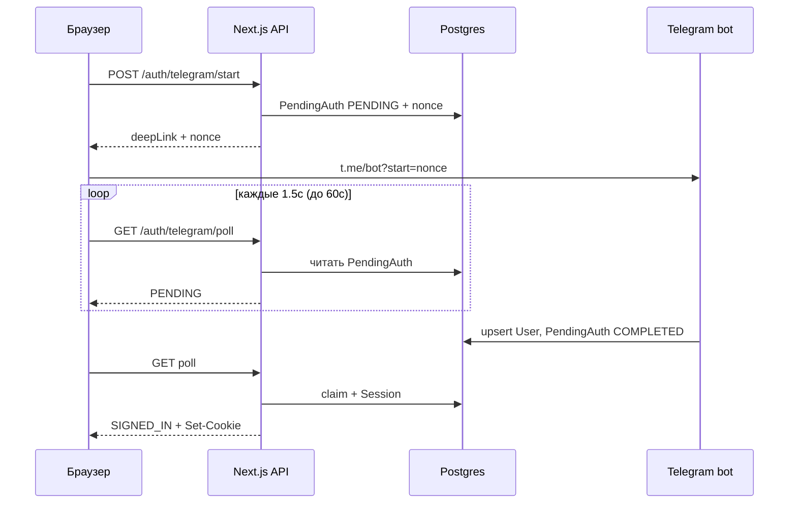

Авторизация через Telegram здесь — это **login via bot deep-link + polling**, не Login Widget Telegram. Сайт и бот — два разных процесса.

## Участники

| Часть | Роль |
|---|---|
| UI (`TelegramLogin` в модалке) | Старт и ожидание |
| `POST /api/auth/telegram/start` | Создаёт одноразовый `nonce` |
| Бот `scripts/telegram-bot.ts` | Подтверждает личность в Telegram |
| `GET /api/auth/telegram/poll` | Выдаёт сессию браузеру |
| Таблица `PendingAuth` | Связка «сайт ↔ бот» |

Бот **не** стартует с Next.js. Нужен отдельно: `npm run bot:telegram`.

---

## Пошаговый поток

### 1. Пользователь жмёт «Продолжить с Telegram»

Модалка (`AuthModalHost`) рендерит `TelegramLogin`. Клиент делает:

```
POST /api/auth/telegram/start
```

Сервер:
- rate limit: 10 запросов / 10 мин;
- генерирует `nonce` (32 hex-символа);
- пишет `PendingAuth` со статусом `PENDING`, TTL **5 минут**;
- возвращает deep-link: `https://t.me/<TELEGRAM_BOT_USERNAME>?start=<nonce>`.

### 2. Открывается бот

Клиент открывает deep-link в новой вкладке и начинает polling каждые **1.5 с**, максимум **60 с**.

### 3. Пользователь жмёт Start в Telegram

Бот ловит `/start <nonce>` и:
1. Ищет `PendingAuth` по nonce.
2. Проверяет: есть, статус `PENDING`, не истёк.
3. Берёт `telegramId` / username / имя из сообщения.
4. `User.upsert` по `telegramId` (роль `CUSTOMER`).
5. Ставит `PendingAuth` в `COMPLETED` + привязывает `userId`.
6. Пишет в чат: «Авторизация завершена…».

Сессию на сайте бот **не** создаёт — только помечает pending как готовый.

### 4. Браузер узнаёт об успехе

`GET /api/auth/telegram/poll?nonce=...`:
- пока `PENDING` → `{ status: "PENDING" }`;
- если истёк → `EXPIRED`;
- если `COMPLETED` → атомарно «забирает» запись (`COMPLETED` → `CANCELED`), вызывает `createSession(userId)`, удаляет pending, отвечает `SIGNED_IN`.

`createSession`:
- пишет `Session` в БД (в БД — **hash** токена);
- ставит httpOnly cookies: `giftskg_session` + signed auth token;
- TTL сессии — **30 дней**.

Клиент при `SIGNED_IN` делает `window.location.href = "/"`.

---

## Схема



---

## Env

- `TELEGRAM_BOT_TOKEN` — для бота (`npm run bot:telegram`)
- `TELEGRAM_BOT_USERNAME` — для deep-link на сайте (без `@`)

Оба должны указывать на **одного и того же** бота.

---

## Важные нюансы

1. **Без запущенного бота вход никогда не завершится** — poll будет крутить `PENDING` до клиентского таймаута 60 с.
2. `etno-bot/` — другой проект; к этому флоу не относится.
3. В схеме есть статус `AWAITING_PHONE`, но в текущем коде бота/API он **не используется**.
4. Fallback username в start-route: `"etno_bot"` — если env не задан, deep-link может увести не в тот бот.
5. Защита от гонок: poll «claim’ает» nonce через `updateMany`, чтобы параллельные вкладки не получили две сессии.

---

Отдельно: ошибка `OrderItem.productName does not exist` из терминала — это **не авторизация**, а рассинхрон Prisma-схемы и БД на странице `/orders`. Если нужно — могу отдельно разобрать и её (в Ask mode только объяснить; для фикса переключись в Agent).